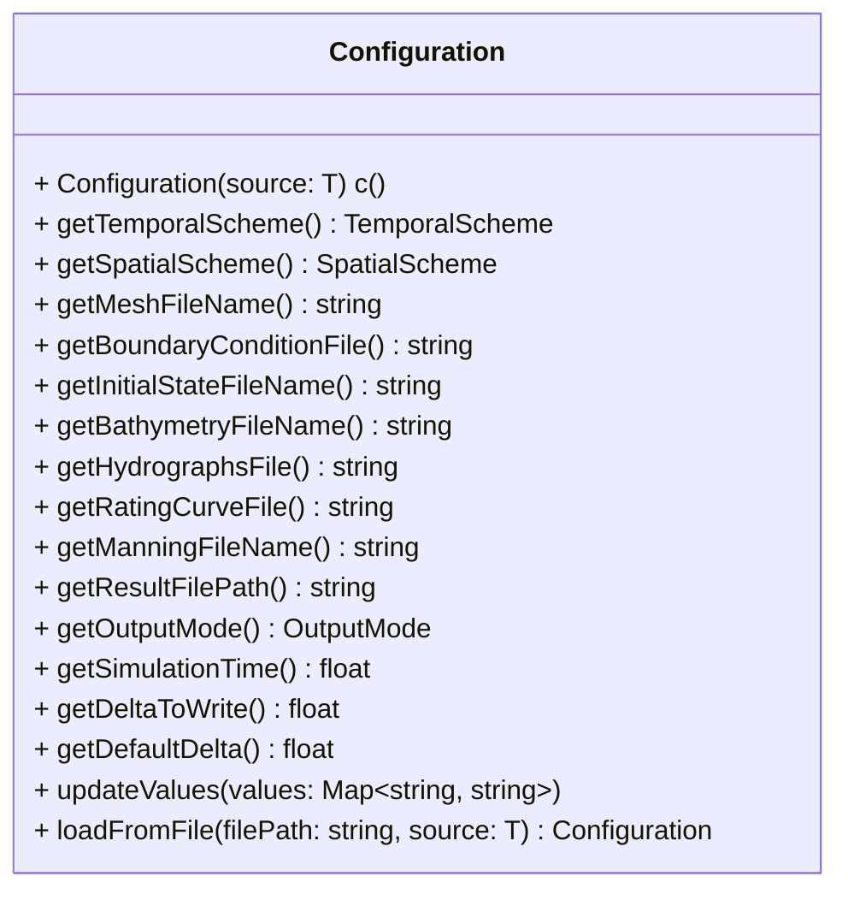
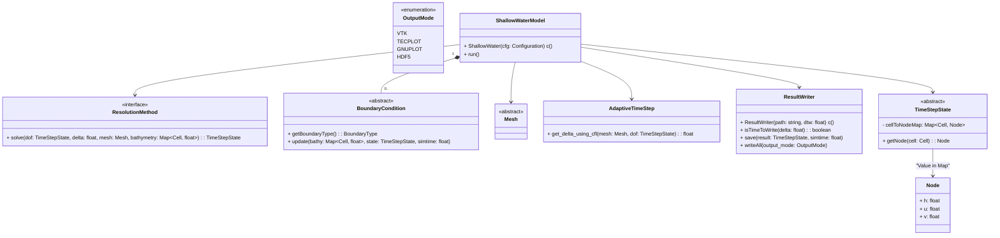
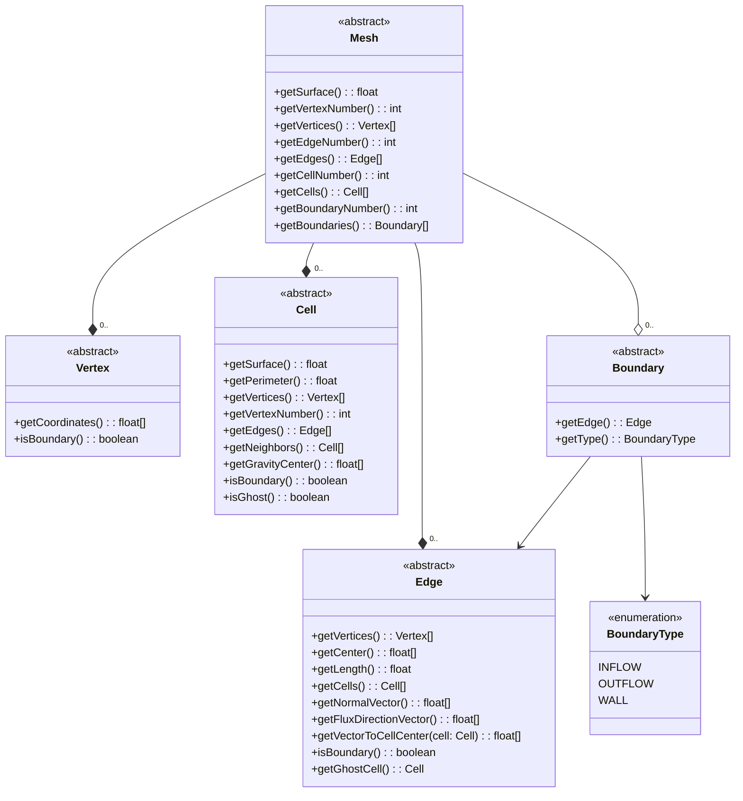
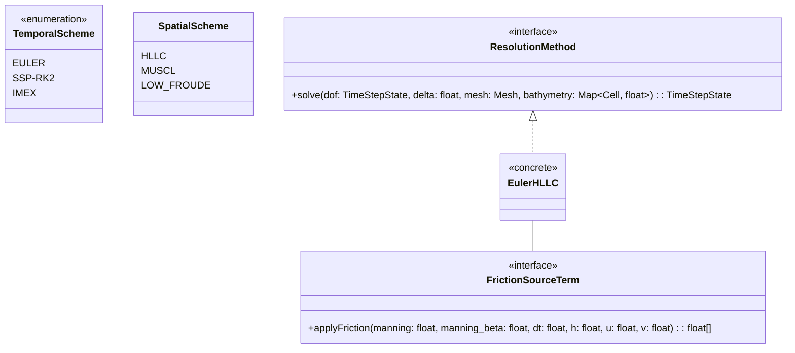

# Dassflow2d-py

This repository is a translation and optimization of [dassflow2d](https://github.com/DassHydro/dassflow2d).
So far, only the direct translation is considered. The inverse problem will be tackled later.

---

## Description
This project aims to simulate water flows using the shallow water equations.

### Architecture
Here you can find the architecture of the project in detail:

**User Layer:**


**Model Layer:**


**Mesh:**


**Resolution Layer:**


---

### Future
The next steps of the project are to implement the resolution method for Euler x HLLC.
The algorithm for such implementation is already done. Here is the pseudo-code:


---

## Setup
To set up the project, we recommend using a virtual environment of your choice to manage package installation.
All packages needed are stored in `requirements.txt`, and you have to use `pip install -r requirements.txt` to install all of them.

### Venv
The Python virtual environment module is supported. You just have to run these two commands:
```bash
./scripts/venvinstall.sh
source .venv/bin/activate
```

### Anaconda

There is no Anaconda script to use, though you can do the same as with `venv`.
You will need to create a virtual environment, then use `pip install -r requirements.txt`.

## Contributions

This project is open to contributions. Feel free to fork and create a pull request!
