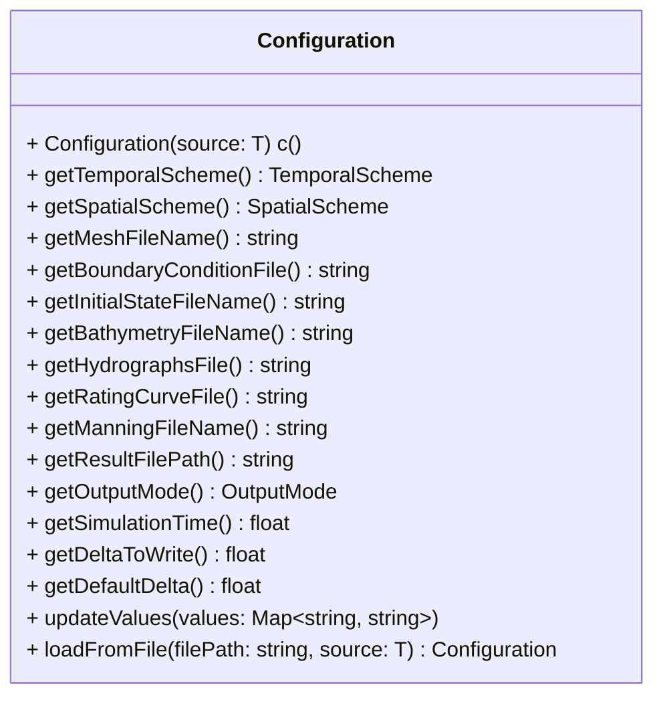
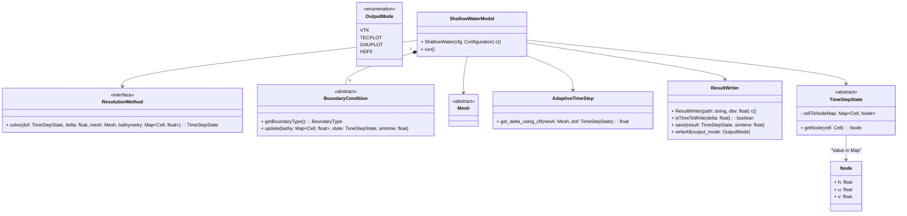
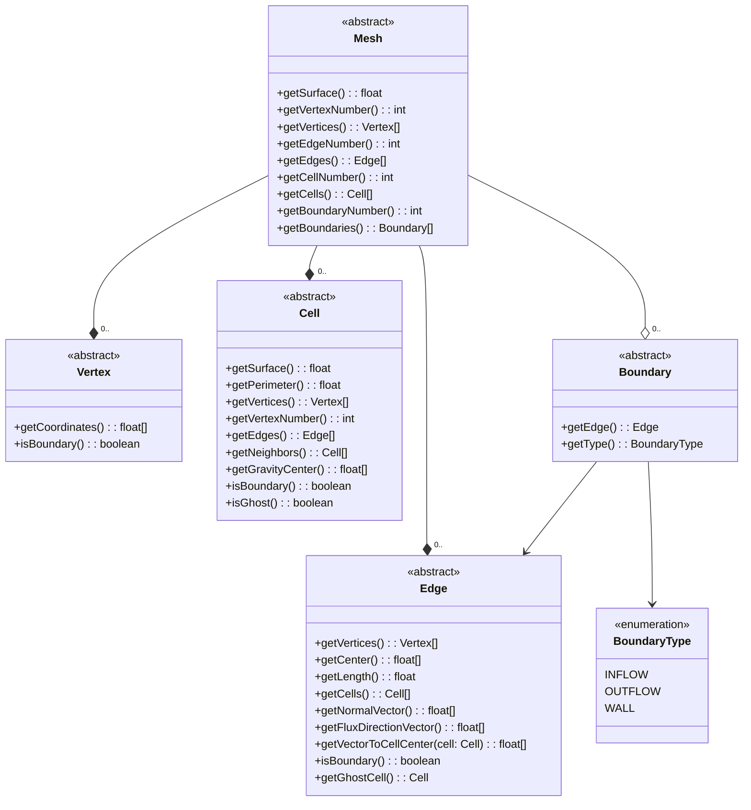
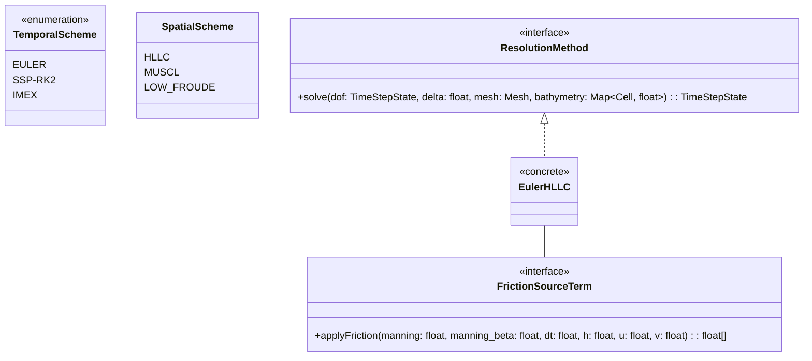

# Architecture

This markdown documentation presents class diagrams of the project architecture, layer by layer.

The documentation is segmented in the following layers:
- User Layer
- Model Layer
- Resolution Layer

## User Layer

## Model Layer

### Mesh details

## Resolution Layer

